<div id="page">

<div id="main" class="aui-page-panel">

<div id="main-header">

<div id="breadcrumb-section">

1.  <span>[TechSys](index.html)</span>

</div>

# <span id="title-text"> TechSys : AT-Gateway - API Specifications </span>

</div>

<div id="content" class="view">

<div class="page-metadata">

Created by <span class="author"> Bovet Laurent, I212</span>, last
modified by <span class="editor"> Meyer Martin, I223 extern</span> on
Oct 26, 2018

</div>

<div id="main-content" class="wiki-content group">

<div class="toc-macro rbtoc1543417989776">

  - [1. Overview](#AT-Gateway-APISpecifications-Overview)
  - [2. Public Access](#AT-Gateway-APISpecifications-PublicAccess)
      - [2.1. Github](#AT-Gateway-APISpecifications-Github)
          - [2.1.1. Compare](#AT-Gateway-APISpecifications-Compare)
      - [2.2. nuget.org](#AT-Gateway-APISpecifications-nuget.org)
  - [3. ATG-API Standard PubSub
    Specification](#AT-Gateway-APISpecifications-ATG-APIStandardPubSubSpecification)
      - [3.1. Introduction](#AT-Gateway-APISpecifications-Introduction)
      - [3.2. References](#AT-Gateway-APISpecifications-References)
      - [3.3. Principles](#AT-Gateway-APISpecifications-Principles)
      - [3.4. Protocol](#AT-Gateway-APISpecifications-Protocol)
      - [3.5. Topics](#AT-Gateway-APISpecifications-Topics)
          - [3.5.1. Pattern](#AT-Gateway-APISpecifications-Pattern)
          - [3.5.2. Semantics](#AT-Gateway-APISpecifications-Semantics)
          - [3.5.3. Resources, Operations and
            Events](#AT-Gateway-APISpecifications-Resources,OperationsandEvents)
          - [3.5.4. Status
            Message](#AT-Gateway-APISpecifications-StatusMessage)
      - [3.6. Interaction Sequence
        Patterns](#AT-Gateway-APISpecifications-InteractionSequencePatterns)
          - [3.6.1. get-request
            (Pull)](#AT-Gateway-APISpecifications-get-request\(Pull\))
          - [3.6.2.
            set-request](#AT-Gateway-APISpecifications-set-request)
          - [3.6.3. update
            (Push)](#AT-Gateway-APISpecifications-update\(Push\))
      - [3.7. Client
        Behaviour](#AT-Gateway-APISpecifications-ClientBehaviour)
          - [3.7.1.
            Connection](#AT-Gateway-APISpecifications-Connection)
          - [3.7.2. Last Will](#AT-Gateway-APISpecifications-LastWill)
          - [3.7.3. Topic and Broker
            Configuration](#AT-Gateway-APISpecifications-TopicandBrokerConfiguration)
          - [3.7.4. Retained
            Messages](#AT-Gateway-APISpecifications-RetainedMessages)
          - [3.7.5. Empty
            Messages](#AT-Gateway-APISpecifications-EmptyMessages)
      - [3.8. Message
        Format](#AT-Gateway-APISpecifications-MessageFormat)
  - [4. ATG-API
    cen-mc-rc](#AT-Gateway-APISpecifications-ATG-APIcen-mc-rc)
      - [4.1. API Resources and
        Links](#AT-Gateway-APISpecifications-APIResourcesandLinks)
          - [4.1.1. Internal](#AT-Gateway-APISpecifications-Internal)
          - [4.1.2. Public](#AT-Gateway-APISpecifications-Public)
      - [4.2. Use-Cases](#AT-Gateway-APISpecifications-Use-Cases)
          - [4.2.1. Standard Sortierablauf zwischen ASL und
            ZDS](#AT-Gateway-APISpecifications-StandardSortierablaufzwischenASLundZDS)
          - [4.2.2. Übersicht](#AT-Gateway-APISpecifications-Übersicht)
              - [4.2.2.1.
                Kurzbeschreibung](#AT-Gateway-APISpecifications-Kurzbeschreibung)
          - [4.2.3. Diagramm](#AT-Gateway-APISpecifications-Diagramm)
          - [4.2.4.
            Beispiel-Requests](#AT-Gateway-APISpecifications-Beispiel-Requests)
              - [4.2.4.1. Beispiel für Step 2:
                submit-mailpiece](#AT-Gateway-APISpecifications-BeispielfürStep2:submit-mailpiece)
              - [4.2.4.2. Beispiel für Step
                6: request-mailpiece-attributes](#AT-Gateway-APISpecifications-BeispielfürStep6:request-mailpiece-attributes)
              - [4.2.4.3. Beispiel für Step 9/5:
                transmit-malpiece-attributes](#AT-Gateway-APISpecifications-BeispielfürStep9/5:transmit-malpiece-attributes)
              - [4.2.4.4. Beispiel für Step 10:
                update-mailpiece-attributes](#AT-Gateway-APISpecifications-BeispielfürStep10:update-mailpiece-attributes)
  - [5. ATG-API
    cen-sortplan](#AT-Gateway-APISpecifications-ATG-APIcen-sortplan)
      - [5.1. API Resources and
        Links](#AT-Gateway-APISpecifications-APIResourcesandLinks.1)
          - [5.1.1. Internal](#AT-Gateway-APISpecifications-Internal.1)
          - [5.1.2. Public](#AT-Gateway-APISpecifications-Public.1)
      - [5.2. Use-Cases](#AT-Gateway-APISpecifications-Use-Cases.1)
          - [5.2.1. ATG-1 Zielbezeichnungsdaten
            empfangen](#AT-Gateway-APISpecifications-ATG-1Zielbezeichnungsdatenempfangen)
              - [5.2.1.1. Beispiel
                outlet-group-labels](#AT-Gateway-APISpecifications-Beispieloutlet-group-labels)
          - [5.2.2. ATG-2 Zieltabelle verteilen und
            aktivieren](#AT-Gateway-APISpecifications-ATG-2Zieltabelleverteilenundaktivieren)
              - [5.2.2.1. Beispiel
                outlet-table](#AT-Gateway-APISpecifications-Beispieloutlet-table)
          - [5.2.3. ATG-11 Sonderendstellen verteilen und
            aktivieren](#AT-Gateway-APISpecifications-ATG-11Sonderendstellenverteilenundaktivieren)
              - [5.2.3.1. Beispiel
                special-sort-table](#AT-Gateway-APISpecifications-Beispielspecial-sort-table)
  - [6. ATG-API
    vsi-process-control](#AT-Gateway-APISpecifications-ATG-APIvsi-process-control)
      - [6.1. API Resources and
        Links](#AT-Gateway-APISpecifications-APIResourcesandLinks.2)
          - [6.1.1. Internal](#AT-Gateway-APISpecifications-Internal.2)
          - [6.1.2. Public](#AT-Gateway-APISpecifications-Public.2)
      - [6.2. Use-Cases](#AT-Gateway-APISpecifications-Use-Cases.2)
          - [6.2.1. Allgemeiner
            Ablauf](#AT-Gateway-APISpecifications-AllgemeinerAblauf)
          - [6.2.2.
            Detailübersicht](#AT-Gateway-APISpecifications-Detailübersicht)
          - [6.2.3. Verbindungs-Aufbau und
            Abbau](#AT-Gateway-APISpecifications-Verbindungs-AufbauundAbbau)
              - [6.2.3.1. Beispiel für Step 5: state (Push
                States)](#AT-Gateway-APISpecifications-BeispielfürStep5:state\(PushStates\))
              - [6.2.3.2. Beispiel für Step 11: messages (Push
                Alarme)](#AT-Gateway-APISpecifications-BeispielfürStep11:messages\(PushAlarme\))
              - [6.2.3.3. Beispiel für Step 15: state:set (Set
                Enabled)](#AT-Gateway-APISpecifications-BeispielfürStep15:state:set\(SetEnabled\))
              - [6.2.3.4. Beispiel für Step 16: state:set:status (Push
                changes Set
                Enabled)](#AT-Gateway-APISpecifications-BeispielfürStep16:state:set:status\(PushchangesSetEnabled\))
          - [6.2.4. ATG-7 Parameter-Status
            empfangen](#AT-Gateway-APISpecifications-ATG-7Parameter-Statusempfangen)
              - [6.2.4.1. Beispiel für Step 1: parameter-metadata
                (Return available
                parameters)](#AT-Gateway-APISpecifications-BeispielfürStep1:parameter-metadata\(Returnavailableparameters\))
              - [6.2.4.2. Beispiel für Step 7: parameter-values:set (Set
                Parameter)](#AT-Gateway-APISpecifications-BeispielfürStep7:parameter-values:set\(SetParameter\))
              - [6.2.4.3. Beispiel für Step 10: parameter-values
                (Parameter
                Updated)](#AT-Gateway-APISpecifications-BeispielfürStep10:parameter-values\(ParameterUpdated\))
          - [6.2.5. ATG-9 Live-Daten
            empfangen](#AT-Gateway-APISpecifications-ATG-9Live-Datenempfangen)
              - [6.2.5.1. Beispiel für Step 1:
                fill-levels](#AT-Gateway-APISpecifications-BeispielfürStep1:fill-levels)
              - [6.2.5.2. Beispiel für Step 2:
                read-rates](#AT-Gateway-APISpecifications-BeispielfürStep2:read-rates)
          - [6.2.6. ATG-10 Statistik-Daten
            empfangen](#AT-Gateway-APISpecifications-ATG-10Statistik-Datenempfangen)
              - [6.2.6.1. Beispiel für Step 1: statistics
                (Stats)](#AT-Gateway-APISpecifications-BeispielfürStep1:statistics\(Stats\))
          - [6.2.7. ATG-11 Track-Event-Daten
            empfangen](#AT-Gateway-APISpecifications-ATG-11Track-Event-Datenempfangen)
              - [6.2.7.1. Beispiel für Step 1: track-events (discharge,
                induction)](#AT-Gateway-APISpecifications-BeispielfürStep1:track-events\(discharge,induction\))

</div>

# <span class="nh-number">1. </span>Overview

This documentation describes all APIs the AT Gateway supports. These
pages also contain the links to the API definition resources and
artifacts.

For a general overview of the concepts that apply to all APIs, see the
chapter [ATG-API Standard PubSub
Specification](https://wikit.post.ch/display/TEC/ATG-API+Standard+PubSub+Specification).

# <span class="nh-number">2. </span>Public Access

## <span class="nh-number">2.1. </span>Github

The source code of the APIs as well as the generated artifacts and
documentation is publicly exposed in Github. For links, see the
corresponding sub page.

  - Releases are tagged with a **release/{version}** tag,
    e.g. <https://github.com/swisspush/cen-mc-rc/releases/tag/release%2F1.0.0-rc.9>
  - Additionally, there is a **dist/{version}** tag that also contains
    the generated artifacts (at model and doc),
    e.g. <https://github.com/swisspush/cen-mc-rc/releases/tag/dist%2F1.0.0-rc.9>

### <span class="nh-number">2.1.1. </span>Compare

We can use Github functionality to compare to release versions, e.g.
differences between version **1.0.0-rc.9** and **1.0.0-rc.10** of
**cen-mc-rc**: <https://github.com/swisspush/cen-mc-rc/compare/dist/1.0.0-rc.9...dist/1.0.0-rc.10>

## <span class="nh-number">2.2. </span>[nuget.org](http://nuget.org)

The NuGet packages of the APIs containing the generated C\# classes that
map from and to the APIs JSON structures are published to the
[https://www.nuget.org](https://www.nuget.org/) repository.
Corresponding links are available on the sub
pages.

<div class="included-child-page">

# <span class="nh-number">3. </span>ATG-API Standard PubSub Specification

<div class="included-child-page-body">

 

<div class="toc-macro rbtoc1543417990167">

  - [Introduction](#AT-Gateway-APISpecifications-Introduction)
  - [References](#AT-Gateway-APISpecifications-References)
  - [Principles](#AT-Gateway-APISpecifications-Principles)
  - [Protocol](#AT-Gateway-APISpecifications-Protocol)
  - [Topics](#AT-Gateway-APISpecifications-Topics)
      - [Pattern](#AT-Gateway-APISpecifications-Pattern)
      - [Semantics](#AT-Gateway-APISpecifications-Semantics)
      - [Resources, Operations and
        Events](#AT-Gateway-APISpecifications-Resources,OperationsandEvents)
      - [Status Message](#AT-Gateway-APISpecifications-StatusMessage)
  - [Interaction Sequence
    Patterns](#AT-Gateway-APISpecifications-InteractionSequencePatterns)
      - [get-request
        (Pull)](#AT-Gateway-APISpecifications-get-request\(Pull\))
      - [set-request](#AT-Gateway-APISpecifications-set-request)
      - [update (Push)](#AT-Gateway-APISpecifications-update\(Push\))
  - [Client Behaviour](#AT-Gateway-APISpecifications-ClientBehaviour)
      - [Connection](#AT-Gateway-APISpecifications-Connection)
      - [Last Will](#AT-Gateway-APISpecifications-LastWill)
      - [Topic and Broker
        Configuration](#AT-Gateway-APISpecifications-TopicandBrokerConfiguration)
      - [Retained
        Messages](#AT-Gateway-APISpecifications-RetainedMessages)
      - [Empty Messages](#AT-Gateway-APISpecifications-EmptyMessages)
  - [Message Format](#AT-Gateway-APISpecifications-MessageFormat)

</div>

## <span class="nh-number">3.1. </span>Introduction

This chapter exposes the standard way for integrating systems together
via the AT-Gateway. This applies to all PubSub interfaces (a.k.a
asynchronous APIs) exposed by the AT-Gateway and covers the common
aspects. API-specific aspects are covered in dedicated API
specifications.

## <span class="nh-number">3.2. </span>References

1.  <https://en.wikipedia.org/wiki/Publish%E2%80%93subscribe_pattern>
2.  <https://en.wikipedia.org/wiki/MQTT>
3.  <https://semver.org/>
4.  <https://www.json.org/>
5.  <http://json-schema.org/>

## <span class="nh-number">3.3. </span>Principles

1.  The communication uses a topic-based
    [publish-subscribe](https://en.wikipedia.org/wiki/Publish%E2%80%93subscribe_pattern) pattern
    \[1\]. 
2.  Systems are spatially decoupled, they must only know the AT-Gateway.
3.  Systems are timely coupled, there is no delayed delivery in case of
    system down, except for the last message of a topic if specified so
    (retained messages).
4.  There is no message queue persistence. The AT-Gateway basically
    plays the role of an in-memory event bus.
5.  Formal API definitions are provided in swagger format for
    documentation but they are *not *REST APIs, please
    mentally substitute POST with PUBLISH.

## <span class="nh-number">3.4. </span>Protocol

1.  The publish-subscribe protocol
    is [MQTT](https://en.wikipedia.org/wiki/MQTT) 3.1.1 \[2\].
2.  Quality of service is 1, at least once delivery (acknowledged
    delivery).
3.  No persistent session. `cleanSession` always set to true.

## <span class="nh-number">3.5. </span>Topics

  - Related topics are grouped in versioned asynchronous APIs.
  - Topic names are kebab-case (all lowercase and words are separated
    with dashes). Except system names that are uppercase.

### <span class="nh-number">3.5.1. </span>Pattern

Topics follow the
pattern `API_NAME/VERSION/ROLE/SUBJECT/SRC_SYSTEM/SRC_INSTANCE/[DEST_SYSTEM/DEST_INSTANCE/][CONVERSATION_ID].`

<span style="letter-spacing: 0.0px;">Example: </span>`cen-mc-rc/v1/machine/submit-mailpiece/TRC/21/`

  - `API_NAME` correspond to the title of the API specification.
  - `VERSION` is the major version number of the API, following
    [semver](https://semver.org/)\[3\] compatibility rules.
  - `ROLE` is a logical identification if the system publishing on this
    topic.
  - `SUBJECT` corresponds to the message type posted in this topic.
  - `SRC_SYSTEM` is the standardized uppercase short name given to the
    posting system.
  - `SRC_INSTANCE` is the three-digit number of the system instance.
  - `CONVERSATION_ID`: When issuing a request that will trigger a
    response, a conversationId must be submitted in order to be able to
    correlate the response to the request. The conversationId must also
    be submitted by the responding system (also see
    **[00.StandardPubSubSpecification-Resources,OperationsandEvents](#AT-Gateway-APISpecifications-00.StandardPubSubSpecification-Resources,OperationsandEvents))**.
    Example:
      - Request:
        my\_api/v1/role/subject:get/<span style="color: rgb(51,102,255);">**SYS\_A**</span>/**<span style="color: rgb(51,102,255);">01</span>**/<span style="color: rgb(255,0,0);">**12345**</span>
      - Response:
        my\_api/v1/role/subject:get:status/SYS\_B/02/**<span style="color: rgb(51,102,255);">SYS\_A</span>**/**<span style="color: rgb(51,102,255);">01</span>**/**<span style="color: rgb(255,0,0);">12345</span>**

### <span class="nh-number">3.5.2. </span>Semantics

  - Each API specification specifies the mandatory segments of each
    topic.
  - Clients basically subscribe to `API_NAME/VERSION/ROLE/#` 
      - ") For
        performance reasons, subscriptions may be split up into more
        specific sub-subscriptions. But conceptually, the client should
        be able to deal with any message topics sent to him. If it is
        not supposed to handle a certain topic, it should just ignore
        this message. For details,
        see [00.StandardPubSubSpecification-TopicFiltering](#AT-Gateway-APISpecifications-00.StandardPubSubSpecification-TopicFiltering)
  - For point-to-point or multicast messaging, clients filter the
    message with the topic
    pattern <span>`API_NAME/VERSION/ROLE/+/+/DEST_SYSTEM/DEST_INSTANCE`
    to handle only messages addressed to them. In API definitions,
    such behavior is specified in the formal topic pattern.</span>
  - When responding to a point-to-point request,` DEST_SYSTEM`,
    `DEST_INSTANCE` must be filled with the `SRC_SYSTEM` and
    `SRC_INSTANCE` used in the request. In API definitions,
    such behavior is specified in the formal topic pattern.
  - When responding to a point-to-point request containing
    a `CONVERSATION_ID`, this latter must be used for the response
    topic. In API definitions, such behavior is specified in the formal
    topic pattern.
  - When a conversation id is required but the destination is not known,
    `DEST_SYSTEM` and `DEST_INSTANCE`  are replaced with question marks
    (e.g. <span>`cen-mc-rc/v1/control/query-parameters/MDS/21/?/?/444883`).</span><span>  
    </span>

### <span class="nh-number">3.5.3. </span>Resources, Operations and Events

The subject can denote resources, operations or events. When these are
related, they appear in the subject name.

`RESOURCE:OPERATION`,
example: `parameter-list:get`<span style="font-family: monospace;">  
</span>

  - A topic with such a subject will be use to request the current
    parameter list resource. As a result, the resource will be provided
    in the corresponding topic with subject `parameter-list`.
  - The set of operations (get, set, ...) is not normatively defined.

`RESOURCE:EVENT`, example: `parameter-list:status`

  - Such a topic informs about something that happened on the resource
    (e.g. that it has been deleted).

The set of events is not normatively defined but the mandatory fields of
the status event are (see below).   
  
`RESOURCE:OPERATION:EVENT`, example: `parameter-list:get:status`

  - Such a topic informs about something that happened on
    an <span class="underline">operation</span> related to the
    resource. In such an interaction, the conversation id is mandatory.

The set of events is not normatively defined but the mandatory fields of
the status event are (see below). 

### <span class="nh-number">3.5.4. </span>Status Message

The content of these events are normed. They contain a `state` field
having values taken from a subset of:

<div class="table-wrap">

<table>
<thead>
<tr class="header">
<th>Value</th>
<th>Resource</th>
<th>Operation</th>
</tr>
</thead>
<tbody>
<tr class="odd">
<td><code>OK</code></td>
<td>The resource is in a consistent state</td>
<td>The operation was performed successfully</td>
</tr>
<tr class="even">
<td><code>ERROR</code></td>
<td>The resource is in an error state</td>
<td><p>The operation failed.</p>
<p>An optional field <em>failedReason</em> (string) may contain additional information on why the operation failed</p></td>
</tr>
<tr class="odd">
<td><code>PROCESSING</code></td>
<td>The resource is being under change and possibly inconsistent</td>
<td>The operation is being processed and not yet finished</td>
</tr>
</tbody>
</table>

</div>

## <span class="nh-number">3.6. </span>Interaction Sequence Patterns

Different use cases require different interaction sequences between the
publishes and the subscriber(s) of a certain topics. The used sequence
patterns are as follows:

### <span class="nh-number">3.6.1. </span>get-request (Pull)

A get-request is issued to trigger an operation on a resource. The
request must include a conversationId. The processing system will
include that ID in its *get:status* message (either successful or
unsuccessful), along with the destination system (which equals the
source system of the get request). In case an operation should return
data, an additional message must be published on the resource topic
without the conversationId (and without the destination
system).

  
<span class="confluence-embedded-file-wrapper" style="">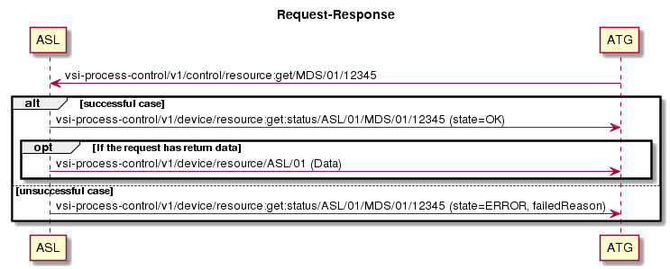</span>

### <span class="nh-number">3.6.2. </span>set-request

A set-request is simular to a get-request, but it contains a data
payload describing on how we want to change a resource. Requests also
include a conversationId which will be included in the status response.
In the successful case, the processing system always publishes a message
containing the updated
data.

  
<span class="confluence-embedded-file-wrapper" style="">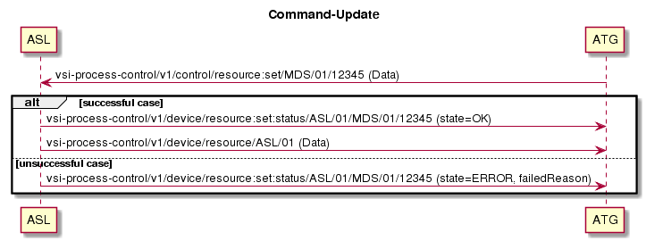</span>

### <span class="nh-number">3.6.3. </span>update (Push)

An update request is published by systems to communicate udpates on a
resource.

") For a
subscribing system, it does not make any difference if a resource update
is published as a push message or as a result of a get- or
set-request.

  
<span class="confluence-embedded-file-wrapper" style="">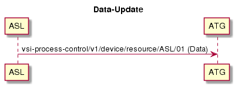</span>

## <span class="nh-number">3.7. </span>Client Behaviour

### <span class="nh-number">3.7.1. </span>Connection

Clients connect using a clientId composed of the system name and
instance (e.g. ASL01).

Upon successful connection, clients must update their state by sending a
client status message:

<div class="table-wrap">

<table>
<tbody>
<tr class="odd">
<td>Topic</td>
<td><code>vsi-process-control/v1/client/status/{SRC_SYSTEM}/{SRC_INSTANCE}</code></td>
</tr>
<tr class="even">
<td>Retain</td>
<td>true</td>
</tr>
<tr class="odd">
<td>QoS</td>
<td>1</td>
</tr>
<tr class="even">
<td>Payload</td>
<td><div class="content-wrapper">
<div class="code panel pdl" style="border-width: 1px;">
<div class="codeContent panelContent pdl">
<pre class="syntaxhighlighter-pre" data-syntaxhighlighter-params="brush: java; gutter: false; theme: Confluence" data-theme="Confluence"><code>{
   &quot;state&quot;: &quot;CONNECTED&quot;,
   &quot;timestamp&quot;: &quot;2018-08-31T08:10:07+00:00&quot;
}</code></pre>
</div>
</div>
</div></td>
</tr>
</tbody>
</table>

</div>

Before cleanly disconnecting, it must send:

<div class="table-wrap">

<table>
<tbody>
<tr class="odd">
<td>Topic</td>
<td><code>vsi-process-control/v1/client/status/{SRC_SYSTEM}/{SRC_INSTANCE}</code></td>
</tr>
<tr class="even">
<td>Retain</td>
<td>true</td>
</tr>
<tr class="odd">
<td>QoS</td>
<td>1</td>
</tr>
<tr class="even">
<td>Payload</td>
<td><div class="content-wrapper">
<div class="code panel pdl" style="border-width: 1px;">
<div class="codeContent panelContent pdl">
<pre class="syntaxhighlighter-pre" data-syntaxhighlighter-params="brush: java; gutter: false; theme: Confluence" data-theme="Confluence"><code>{
   &quot;state&quot;: &quot;DISCONNECTED&quot;,
   &quot;timestamp&quot;: &quot;2018-08-31T08:10:07+00:00&quot;
}</code></pre>
</div>
</div>
</div></td>
</tr>
</tbody>
</table>

</div>

### <span class="nh-number">3.7.2. </span>Last Will

In order to monitor the liveliness of clients, it is required that
clients specify a MQTT Last Will message:

<div class="table-wrap">

<table>
<tbody>
<tr class="odd">
<td>Topic</td>
<td><code>vsi-process-control/v1/client/status/{SRC_SYSTEM}/{SRC_INSTANCE}</code></td>
</tr>
<tr class="even">
<td>Retain</td>
<td>true</td>
</tr>
<tr class="odd">
<td>QoS</td>
<td>1</td>
</tr>
<tr class="even">
<td>Payload</td>
<td><div class="content-wrapper">
<div class="code panel pdl" style="border-width: 1px;">
<div class="codeContent panelContent pdl">
<pre class="syntaxhighlighter-pre" data-syntaxhighlighter-params="brush: java; gutter: false; theme: Confluence" data-theme="Confluence"><code>{
   &quot;state&quot;: &quot;BROKEN&quot;
}</code></pre>
</div>
</div>
</div></td>
</tr>
</tbody>
</table>

</div>

### <span class="nh-number">3.7.3. </span>Topic and Broker Configuration

Clients receive the topic filters they have to subscribe to via
configuration. They subscribe "blindly" to all of them in the given
order.

Clients must be able to filter, route or discard messages for complete
APIs. Indeed, the API subscription can be a wildcard matching all
subjects of a role. (Example: `cen-mc-rc/v1/coding/#`). In this case the
client implementation must discard all messages that are not of
interest, according to the subject, destination system or conversation
id.

In particular, they must filter out messages that are not addressed to
themselves, i.e. when `DEST_SYSTEM` and `DEST_INSTANCE` are not matching
the client. Note that `DEST_SYSTEM` and `DEST_INSTANCE` set to question
mark (`?`) match all clients.

The configuration contains a list of brokers with their node addresses,
the topics filters for publication and
subscription.

<div class="table-wrap">

| Field         | Description                                                                                                                                                                                                                                                                                                                             |
| ------------- | --------------------------------------------------------------------------------------------------------------------------------------------------------------------------------------------------------------------------------------------------------------------------------------------------------------------------------------- |
| mqtt          | Main configuration container.                                                                                                                                                                                                                                                                                                           |
| brokers       | List of configured brokers. At least one broker is configured.                                                                                                                                                                                                                                                                          |
| clientId      | MQTT Client ID to use when connecting to this broker.                                                                                                                                                                                                                                                                                   |
| nodes         | List of DNS names or IP addresses for this broker and TCP port. Clients must use one of them and fallback to the others when connection is not possible. At least one node is provided.                                                                                                                                                 |
| publications  | The topic prefixes that this broker handles for publications from this client. This informs the client which broker must be used for publishing on topics. These are not regexp nor MQTT topic filters, just a prefix strings. This can be absent or empty in the case the configured client is not intended to publish on this broker. |
| subscriptions | The topic filters the client must subscribe to. These are MQTT topic filters. Clients subscribe to all of them and dispatch the messages internally. Can be absent or empty.                                                                                                                                                            |

</div>

  

<div class="code panel pdl" style="border-width: 1px;">

<div class="codeHeader panelHeader pdl" style="border-bottom-width: 1px;">

**Example**

</div>

<div class="codeContent panelContent pdl">

``` syntaxhighlighter-pre
"mqtt": {
    "brokers": [
        {
            "clientId": "ASL01",
            "nodes": [ 
                 { 
                    "host": "10.34.44.22", 
                    "port": 3333
                 },
                 { 
                    "host": "vp034k", 
                    "port": 3334
                 },
             ],
            "publications": [ "vsi-process-control/v1", "cen-sortplan/v1" ],
            "subscriptions": [ "vsi-process-control/v1/control/#", "cen-sortplan/v1/control/#" ]
        },
        {   
            "clientId": "ASL01",
            "nodes": [ 
                 { 
                    "host": "10.34.44.22", 
                    "port": 3333
                 }
            ],
            "publications": [ "cen-mc-rc/v1" ],
            "subscriptions": [ "cen-mc-rc/v1/coding/transmit-mailpiece-attributes/+/+", 
                               "cen-mc-rc/v1/coding/transmit-mailpiece-attributes/+/+/ASL/+/+" ]
        }
    }
}
```

</div>

</div>

  

### <span class="nh-number">3.7.4. </span>Retained Messages

Certain topics contain messages describing a current state that is
updated by it's corresponding source system using push requests. Often,
we'll want these messages to be sent with the MQTT retained flat set to
true so the broker can cache the latest state and send them to clients
on re-subscribe.

All topics that are supposed to receive retained messages are flagged
with a prefix **🔂\[RETAINED\]** in the API definition. It is the
responsibility of the corresponding source system sending the message to
set the retained flag accordingly.

The broker will be set up to persist retained messages and reload them
on possible broker restarts.

Note that retained message topics will usually still contain the source
system and instance,
e.g. *vsi-process-control/v1/client/status/{SRC\_SYSTEM}/{SRC\_INSTANCE}*.
Subscribing clients should therefore subscribe on the topic using
wildcards to avoid coupling to the source system.

It is the responsibility of the broker to implement a adequate handling
for source system renames or the like on a retained topic.

### <span class="nh-number">3.7.5. </span>Empty Messages

Because of the mechanism used to delete retained messages, clients must
accept and silently discard messages that have no payload.

## <span class="nh-number">3.8. </span>Message Format

1.  Messages are formatted in [JSON](https://www.json.org/) \[4\].
    Character encoding of the messages is **UTF-8**.
2.  API definitions describe message types using [JSON
    Schema](http://json-schema.org/) v4 \[5\].
3.  All messages in a given topic use the same message type.
4.  Topics with same API, VERSION and SUBJECT contain messages of the
    same type.

</div>

</div>

<div class="included-child-page">

# <span class="nh-number">4. </span>ATG-API cen-mc-rc

<div class="included-child-page-body">

<div class="toc-macro rbtoc1543417990915">

  - [API Resources and
    Links](#AT-Gateway-APISpecifications-APIResourcesandLinks)
      - [Internal](#AT-Gateway-APISpecifications-Internal)
      - [Public](#AT-Gateway-APISpecifications-Public)
  - [Use-Cases](#AT-Gateway-APISpecifications-Use-Cases)
      - [Standard Sortierablauf zwischen ASL und
        ZDS](#AT-Gateway-APISpecifications-StandardSortierablaufzwischenASLundZDS)
      - [Übersicht](#AT-Gateway-APISpecifications-Übersicht)
      - [Diagramm](#AT-Gateway-APISpecifications-Diagramm)
      - [Beispiel-Requests](#AT-Gateway-APISpecifications-Beispiel-Requests)

</div>

<div class="table-wrap">

<table>
<tbody>
<tr class="odd">
<td>API</td>
<td><div class="content-wrapper">
<p><span style="white-space: pre-wrap;">cen-mc-rc</span></p>
</div></td>
<td><div class="content-wrapper">
<p><span style="white-space: pre-wrap;">1.0.0-rc.16</span></p>
</div></td>
</tr>
</tbody>
</table>

</div>

<div class="table-wrap">

<table>
<tbody>
<tr class="odd">
<td><div class="content-wrapper">
<p><a href="https://rawgit.com/swisspush/apikana-doc/v0.4.14.2/index.html?url=/swisspush/cen-mc-rc/release/1.0.0-rc.16/src/openapi/api.yaml">Documentation</a></p>
</div></td>
<td><div class="content-wrapper">
<p><a href="https://github.com/swisspush//cen-mc-rc/tree/dist/1.0.0-rc.16">Distribution</a></p>
</div></td>
</tr>
</tbody>
</table>

</div>

## <span class="nh-number">4.1. </span>API Resources and Links

### <span class="nh-number">4.1.1. </span>Internal

  - Bitbucket
    Repository: <https://gitit.post.ch/projects/TECHSYS/repos/cen-mc-rc/browse/src>
  - Jenkins Build
    Job: <https://jenkinsdotnet.tools.pnet.ch/job/techsys/job/api/job/techsys-api_cen-mc-rc/>
  - Swagger UI for
    **develop**: <https://gitit.post.ch/pages/confluence/apikana-doc/master/browse/?url=/pages/techsys/cen-mc-rc/develop/browse/src/openapi/api.yaml#/>

### <span class="nh-number">4.1.2. </span>Public

  - Swisspush Overview of published
    APIs: <http://www.swisspush.org/apis>
  - Specific release tags in
    Github: <https://github.com/swisspush/cen-mc-rc/releases>
  - NuGet package on
    nuget.org: <https://www.nuget.org/packages/Ch.Post.PL.Api.CenMcRc>

## <span class="nh-number">4.2. </span>Use-Cases

### <span class="nh-number">4.2.1. </span>**Standard Sortierablauf zwischen ASL und ZDS**

****Beinhaltet: ATG-3 Sensordaten empfangen, ATG-4 Sortierziel
berechnen, ATG5- Sortierergebnis empfangen****

### <span class="nh-number">4.2.2. </span>Übersicht

#### <span class="nh-number">4.2.2.1. </span>Kurzbeschreibung

  

Der AT-Gateway fungiert als Proxy zwischen ASL und ZDS und kümmert sich
um die Protokollübersetzung von MQTT nach PP2000 - der ZDS sieht dabei

  

Für die Anbindung des ASL and den Leitstand (BLS) öffnet der AT-Gateway
eine zusätzliche Verbindung ("Verbindung B") zum BLS, wo er als Proxy
fungiert. Das heisst, der AT-Gateway kümmert sich um die
Protokollübersetzung von MQTT nach PP2000, der BLS sieht aber als
Partnersystem das ASL bzw. CLC.

  - Akteur: <span>ASL / ZDS</span>
  - <span><span>Auslösendes Ereignis</span>  
    </span>
  - <span><span><span>Vorbedingung: <span>Der ATG ist über MQTT
    erreichbar.</span></span>  
    </span></span>

### <span class="nh-number">4.2.3. </span><span><span><span><span>Diagramm</span></span></span></span>

<span><span><span><span><span class="confluence-embedded-file-wrapper" style="">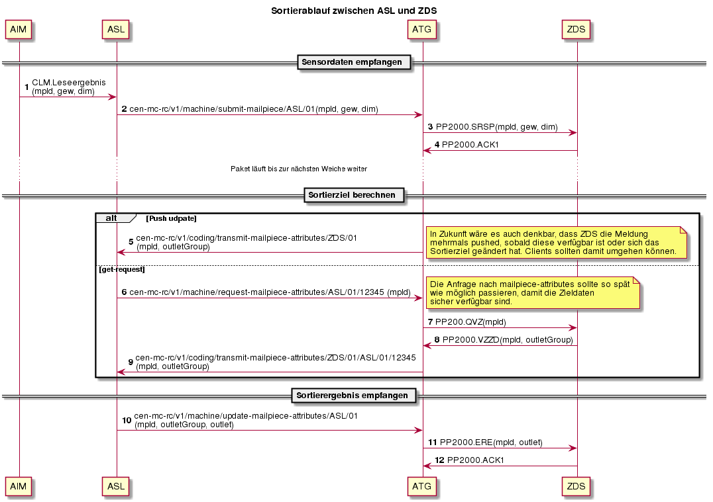</span>  
</span></span></span></span>

### <span class="nh-number">4.2.4. </span><span><span><span><span>Beispiel-Requests</span></span></span></span>

#### <span class="nh-number">4.2.4.1. </span>Beispiel für Step 2: submit-mailpiece

<div class="preformatted panel" style="border-width: 1px;">

<div class="preformattedContent panelContent">

    {
        "mailpieceId": "996003318000369294",
        "timestamp": "2018-03-21T09:30:10+01:00",
        "sourceId": "DWS01",
        "mpAttr": {
           "type": "PARCEL",
           "preknowledge": {
              "multipleMailpiecdIdRecognized": true,
              "location": {
                 "face": "TOP",
                 "polygon": {
                    "dot": [
                       {
                          "x": 3,
                          "y": 396
                       },
                       {
                          "x": 126,
                          "y": 203
                       },
                       {
                          "x": 232,
                          "y": 553
                       },
                       {
                          "x": 361,
                          "y": 360
                       }
                    ]
                 }
              },
              "dimension": {
                  "length": 306,
                  "height": 58,
                  "width": 106,
                  "state": {
                      "measurementResult": "OK",
                      "measurementRange": "INSIDE",
                      "itemSizeClassification": {
                          "ok": true,
                          "oversized": false,
                          "undersized": false
                      }
                  }
              },
              "weight": {
                  "value": 1000,
                  "state": {
                    "isLegalForTrade": true,
                    "packageDistanceError": false,
                    "packageLengthError": false,
                    "externalError": false,
                    "invalidMeasurement": false,
                    "overweight": false,
                    "underweight": false,
                    "overload": false,
                    "underload": false,
                    "conveyorSpeedChangedDuringMeasurement": false,
                    "conveyorSpeedOutOfMaxLimit": false,
                    "alibiStorageAtScaleFailed": false,
                    "scaleDataFormatError": false
                  }
              },
              "legalForTrade": {
                 "actualVolume": 11512,
                 "boxVolume": 11687,
                 "volumeRatio": 98,
                 "shape": "CUBIC",
                 "state": {
                     "conveyorSpeedError": false,
                     "storageError": false,
                     "dimensionError": false,
                     "weightError": false
                 }
              },
              "binOccupancy": {
                 "emptyBinOccupied": false,
                 "binMultipleItemOccupied": false,
                 "frontOverlappingLimitExceeded": false,
                 "backOverlappingLimitExceeded": false,
                 "multipleItemsDetected": false,
                 "conveyingAidDetected": false
              },
              "barCodes": [
                 {
                    "type": "CODE_128",
                    "value": "0509",
                    "status": "DETECTED_AND_RECOGNIZED"
                 },             
                 {
                    "type": "CODE_128",
                    "value": "9981",
                    "status": "DETECTED_AND_RECOGNIZED"
                 },
                 {
                    "type": "CODE_128",
                    "value": "CP923689375CH",
                    "status": "DETECTED_AND_RECOGNIZED"
                 },
                 {
                    "type": "CODE_128",
                    "value": "45093456",
                    "status": "DETECTED_AND_RECOGNIZED"
                 },
                 {
                    "type": "CODE_128",
                    "value": "020450",
                    "status": "DETECTED_AND_RECOGNIZED"
                 },
                 {
                    "type": "DATA_MATRIX",
                    "value": "756109025843770000010000000000000000000003489510005501606300",
                    "status": "DETECTED_AND_RECOGNIZED"
                 }
              ]
           }
        }
     }

</div>

</div>

#### <span class="nh-number">4.2.4.2. </span>Beispiel für Step 6: request-mailpiece-attributes

<div class="preformatted panel" style="border-width: 1px;">

<div class="preformattedContent panelContent">

    {
        "mailpieceId": "996003318000369294",
        "timestamp": "2018-03-21T09:30:10+01:00",
        "sourceId": "TKM01"
    }

</div>

</div>

#### <span class="nh-number">4.2.4.3. </span>Beispiel für Step 9/5: transmit-malpiece-attributes

<div class="preformatted panel" style="border-width: 1px;">

<div class="preformattedContent panelContent">

    {
        "mailpieceId": "996003318000369294",
        "timestamp": "2018-03-21T09:30:10+01:00",
        "addressResult": {
            "code": 570
        }
    }

</div>

</div>

#### <span class="nh-number">4.2.4.4. </span>Beispiel für Step 10: update-mailpiece-attributes

<div class="preformatted panel" style="border-width: 1px;">

<div class="preformattedContent panelContent">

    {
        "mailpieceId": "996003318000369294",
        "timestamp": "2018-03-21T09:30:10+01:00",
        "sourceId": "TKM01",
        "weight": 980,
        "sortBin": 3920,
        "code": 799,
        "finalCoded": true,
        "sortReason": "ITEM_NO_READ"
     }

</div>

</div>

**  
  
**

</div>

</div>

<div class="included-child-page">

# <span class="nh-number">5. </span>ATG-API cen-sortplan

<div class="included-child-page-body">

<div class="toc-macro rbtoc1543417992044">

  - [API Resources and
    Links](#AT-Gateway-APISpecifications-APIResourcesandLinks)
      - [Internal](#AT-Gateway-APISpecifications-Internal)
      - [Public](#AT-Gateway-APISpecifications-Public)
  - [Use-Cases](#AT-Gateway-APISpecifications-Use-Cases)
      - [ATG-1 Zielbezeichnungsdaten
        empfangen](#AT-Gateway-APISpecifications-ATG-1Zielbezeichnungsdatenempfangen)
      - [ATG-2 Zieltabelle verteilen und
        aktivieren](#AT-Gateway-APISpecifications-ATG-2Zieltabelleverteilenundaktivieren)
      - [ATG-11 Sonderendstellen verteilen und
        aktivieren](#AT-Gateway-APISpecifications-ATG-11Sonderendstellenverteilenundaktivieren)

</div>

<div class="table-wrap">

<table>
<tbody>
<tr class="odd">
<td>API</td>
<td><div class="content-wrapper">
<p><span style="white-space: pre-wrap;">cen-sortplan</span></p>
</div></td>
<td><div class="content-wrapper">
<p><span style="white-space: pre-wrap;">1.0.0-rc.6</span></p>
</div></td>
</tr>
</tbody>
</table>

</div>

<div class="table-wrap">

<table>
<tbody>
<tr class="odd">
<td><div class="content-wrapper">
<p><a href="https://rawgit.com/swisspush/apikana-doc/v0.4.14.2/index.html?url=/swisspush/cen-sortplan/release/1.0.0-rc.6/src/openapi/api.yaml">Documentation</a></p>
</div></td>
<td><div class="content-wrapper">
<p><a href="https://github.com/swisspush//cen-sortplan/tree/dist/1.0.0-rc.6">Distribution</a></p>
</div></td>
</tr>
</tbody>
</table>

</div>

## <span class="nh-number">5.1. </span>API Resources and Links

### <span class="nh-number">5.1.1. </span>Internal

  - Bitbucket
    Repository: <https://gitit.post.ch/projects/TECHSYS/repos/cen-sortplan/browse/src>
  - Jenkins Build
    Job: <https://jenkinsdotnet.tools.pnet.ch/job/techsys/job/api/job/techsys-api_cen-sortplan/>
  - Swagger UI
    for **develop**: <https://gitit.post.ch/pages/confluence/apikana-doc/master/browse/?url=/pages/techsys/cen-sortplan/develop/browse/src/openapi/api.yaml#/>

### <span class="nh-number">5.1.2. </span>Public

  - Swisspush Overview of published
    APIs: <http://www.swisspush.org/apis>
  - Specific release tags in
    Github: <https://github.com/swisspush/cen-sortplan/releases>
  - NuGet package on
    [nuget.org](http://nuget.org): <https://www.nuget.org/packages/Ch.Post.PL.Api.CenSortplan>

## <span class="nh-number">5.2. </span>Use-Cases

<div class="table-wrap">

### <span class="nh-number">5.2.1. </span>**ATG-1 Zielbezeichnungsdaten empfangen**

</div>

</div>

</div>

</div>

</div>

</div>

</div>

Kurzbeschreibung

<span lang="DE">Mit dieser Konfiguration wird bestimmt, auf welcher
Endstellengruppe(-Position) welche Zielbezeichnung angezeigt werden
soll. Ist der Anzeigetext zu lang, wird er in der Anzeige abgeschnitten
dargestellt.
<span style="color: rgb(23,43,77);text-decoration: none;">Die
Konfiguration der Endstellenbeschriftung wird vom ZDS über den ATG an
den DPS verteilt und aktiviert. </span></span>

<span lang="DE">Beispiele: </span>

<span lang="DE">outletGroup \[300\] -\> "550"  
outletGroup \[662\] -\> "DAI"  
outletGroup position \[5,1\] -\> "Hinwil AZS"  
outletGroup position \[5,2\] -\> "7530/7542"  
</span>

Akteur

ZDS

Auslösendes Ereignis

<span>UC.ZDS.13.50 Meldung an ATG senden</span>

Vorbedingung

  - MQTT-Client ist mit ATG über MQTT verbunden.
  - ATG-2 : Zieltabelle wurde bereits verteilt und
aktiviert

Diagramm

(Empfohlen)

<div class="content-wrapper">

  
<span class="confluence-embedded-file-wrapper" style="">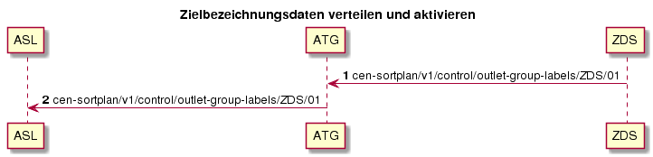</span>

</div>

Beispiel-Requests

<div class="content-wrapper">

#### <span class="nh-number">5.2.1.1. </span>Beispiel outlet-group-labels

<div class="preformatted panel" style="border-width: 1px;">

<div class="preformattedContent panelContent">

    {
        "timestamp": "2018-03-05T15:11:28.000Z",
        "name": "VZTAB.201446.20180222100409.1.1",
        "actions": [
            {
                "sorts": [{
                    "outletGroup": 300
                }],
                "prints": [{
                    "location": "DISPLAY",
                    "format": "550"
                }]
            },
            {
                "sorts": [{
                    "outletGroup": 39
                }],
                "prints": [{
                    "location": "DISPLAY",
                    "format": "455"
                }]
            },
            {
                "sorts": [{
                    "outletGroup": 5,
                    "position": 1
                }],
                "prints": [{
                    "location": "DISPLAY",
                    "format": "Hinwil AZS"
                }]
            },
            {
                "sorts": [{
                    "outletGroup": 5,
                    "position": 2
                }],
                "prints": [{
                    "location": "DISPLAY",
                    "format": "7530/7542"
                }]
            },
            {
                "sorts": [{
                    "outletGroup": 662
                }],
                "prints": [{
                    "location": "DISPLAY",
                    "format": "DAI"
                }]
            },
            {
                "sorts": [
                {
                    "outletGroup": 699
                },
                {
                    "outletGroup": 799
                }],
                "prints": [{
                    "location": "DISPLAY",
                    "format": "Reject"
                }]
            },
            {
                "sorts": [{
                    "outletGroup": 685
                }],
                "prints": [{
                    "location": "DISPLAY",
                    "format": "Mcs"
                }]
            }
        ]
    }

</div>

</div>

</div>

Fragen

<div class="content-wrapper">

  

</div>

  

<div class="table-wrap">

### <span class="nh-number">5.2.2. </span><span style="color: rgb(105,105,105);text-decoration: none;">ATG-2 Zieltabelle verteilen und aktivieren</span>

</div>

Kurzbeschreibung

<span style="color: rgb(23,43,77);text-decoration: none;">Mit dieser
Konfiguration wird bestimmt, welche Endstellen/Displays zu welchen
Endstellengruppen zugeordnet sind inkl. der Verteilungsstrategie auf die
Endstellen.
<span style="color: rgb(23,43,77);text-decoration: none;">Die
Konfiguration der Endstellengruppe wird vom BLS über den ATG an den DPS
und ASL verteilt und aktiviert. </span></span>

outletGroup \[300\] -\> 2220  
outletGroup \[662\] -\> 3110, 3120, 3130, 3140, 3150

Akteur

BLS

Auslösendes Ereignis

<span style="color: rgb(23,43,77);text-decoration: none;">ATG empfängt
die Zieltabelle von BLS</span>

Vorbedingung

<span style="color: rgb(23,43,77);text-decoration: none;">MQTT-Client
ist mit ATG über MQTT
verbunden.</span>

Diagramm

(Empfohlen)

<div class="content-wrapper" style="text-align: left;">

  
<span class="confluence-embedded-file-wrapper" style="">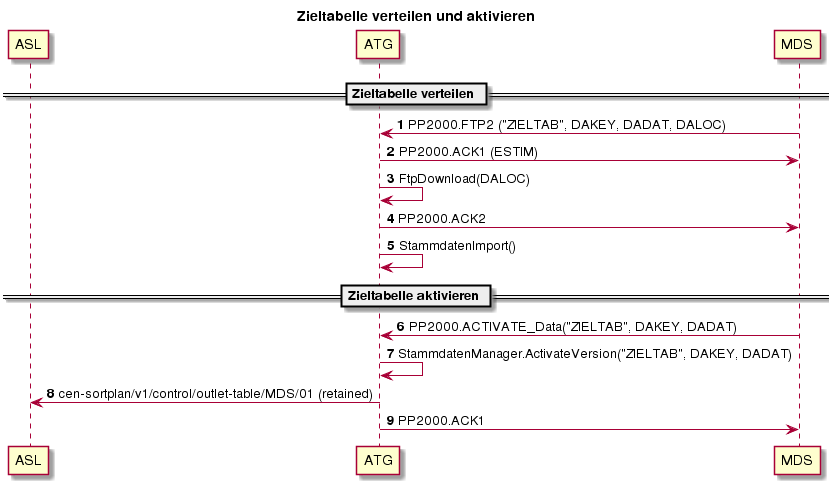</span>

</div>

Beispiel-Requests

<div class="content-wrapper" style="text-align: left;">

#### <span class="nh-number">5.2.2.1. </span>Beispiel outlet-table

<div class="preformatted panel" style="border-width: 1px;">

<div class="preformattedContent panelContent">

    {
        "timestamp": "2018-03-05T15:11:28.000Z",
        "name": "ZIELTAB.201446.20180222100409",
        "outletGroups": [
            {
                "name": 300,
                "tray": 1,            
                "outlets": [
                    {
                        "name": 2220
                    }
                ]
            },
            {
                "name": 39,
                "tray": 1,           
                "outlets": [
                    {
                        "name": 1220
                    }
                ]
            },
            {
                "name": 5,
                "tray": 1,           
                "outlets": [
                    {
                        "name": 1110
                    },
                    {
                        "name": 1120
                    },
                    {
                        "name": 1130
                    }
                ]
            },
            {
                "name": 685,
                "tray": 1,           
                "outlets": [
                    {
                        "name": 2800
                    },
                    {
                        "name": 2810
                    }
                ]
            },
            {
                "name": 699,
                "tray": 1,           
                "specialType": "REJECT_AREA",
                "outlets": [
                    {
                        "name": 2110,
                        "priority": 1
                    },
                    {
                        "name": 2120,
                        "priority": 2
                    },
                    {
                        "name": 2130,
                        "priority": 3
                    }
                ]
            },
            {
                "name": 799,
                "tray": 1,           
                "specialType": "SEQ_OV_AREA",
                "outlets": [               
                    {
                        "name": 3920,
                        "priority": 2
                    },
                    {
                        "name": 3930,
                        "priority": 3
                    }
                ]
            },
            {
                "name": 899,
                "tray": 1,           
                "specialType": "SEQ_OV_AREA",
                "outlets": [               
                    {
                        "name": 3970,
                        "priority": 1
                    },
                    {
                        "name": 3980,
                        "priority": 1
                    },
                    {
                        "name": 3990,
                        "priority": 2
                    }
                ]
            },
            {
                "name": 662,
                "tray": 1,           
                "outlets": [
                    {
                        "name": 3110,
                        "priority": 1
                    },
                    {
                        "name": 3120,
                        "priority": 1
                    },
                    {
                        "name": 3130,
                        "priority": 1
                    },
                    {
                        "name": 3140,
                        "priority": 2
                    },
                    {
                        "name": 3150,
                        "priority": 3
                    }
                ]
            }
        ]
    }

</div>

</div>

</div>

Fragen

<div class="content-wrapper" style="text-align: left;">

  

</div>

  

<div class="table-wrap">

### <span class="nh-number">5.2.3. </span><span style="color: rgb(105,105,105);text-decoration: none;">ATG-11 Sonderendstellen verteilen und aktivieren</span>

</div>

Kurzbeschreibung

<span style="color: rgb(23,43,77);text-decoration: none;">Mit dieser
Konfiguration wird bestimmt, welche Sonderendstellen auf welche
Endstellengruppen zugeordnet sind. Über die Zieltabelle findet man die
dazugehörigen Endstellen.
<span style="color: rgb(23,43,77);text-decoration: none;">Die
Konfiguration der Sonderendstellen wird vom BLS über den ATG an die ASL
verteilt und aktiviert. </span></span>

specialSort \[ITEM\_NO\_READ\] -\> 799  
specialSort \[MAX\_RECIRCULATION\] -\> 899

Akteur

BLS

Auslösendes Ereignis

<span style="color: rgb(23,43,77);text-decoration: none;">ATG empfängt
die Zieltabelle von BLS</span>

Vorbedingung

<span style="color: rgb(23,43,77);text-decoration: none;">MQTT-Client
ist mit ATG über MQTT
verbunden.</span>

Diagramm

(Empfohlen)

<div class="content-wrapper" style="text-align: left;">

  
<span class="confluence-embedded-file-wrapper" style="">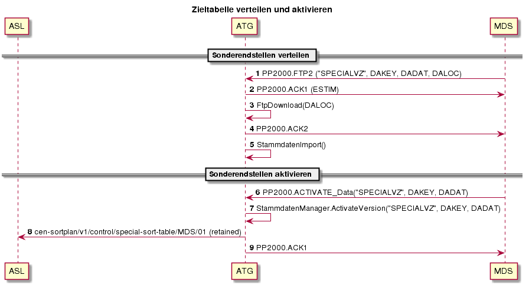</span>

</div>

Beispiel-Requests

<div class="content-wrapper" style="text-align: left;">

#### <span class="nh-number">5.2.3.1. </span>Beispiel special-sort-table

<div class="preformatted panel" style="border-width: 1px;">

<div class="preformattedContent panelContent">

    {
        "timestamp": "2018-03-05T15:11:28.000Z",
        "name": "SPECIALVZ.201446.20180222100409",
        "sortingProducts": [        
            {
                "name": "VZ_SR_1",
                "specialSorts": [
                    {"name": "ITEM_NO_READ"},
                    {"name": "ITEM_MULTIPLE_READ"},
                    {"name": "ITEM_STRAY"},
                    {"name": "ITEM_INDUCTION_ERROR"},
                    {"name": "ITEM_DISCHARGE_ERROR"},
                    {"name": "ITEM_ERROR"},
                    {"name": "ITEM_TRACKING_ERROR"},
                    {"name": "ITEM_OCCUPIED_TWICE_ERROR"},
                    {"name": "ITEM_DISAPPEARED"}
                ]            
            },
            {
                "name": "VZ_SR_2",
                "specialSorts": [
                    {"name": "MAX_RECIRCULATION"},                
                    {"name": "SCANNER_TIMEOUT"},               
                    {"name": "OUTLET_NOT_AVAILABLE"},
                    {"name": "OUTLET_UNKNOWN"},
                    {"name": "UNDEFINED_ERROR"},
                    {"name": "NO_CAPACITY"},
                    {"name": "DIMENSION_ERROR"},
                    {"name": "WEIGHT_ERROR"}
                ]            
            }
        ],
        "actions": [         
            {
                "sortingProduct": "VZ_SR_1",
                "sorts": [{
                    "outletGroup": 799
                }]
            },
            {
                "sortingProduct": "VZ_SR_2",
                "sorts": [{
                    "outletGroup": 899
                }]
            }
        ]
    }

</div>

</div>

</div>

Fragen

<div class="content-wrapper" style="text-align: left;">

  

</div>

  

  

<div class="included-child-page">

# <span class="nh-number">6. </span>ATG-API vsi-process-control

<div class="included-child-page-body">

<div class="toc-macro rbtoc1543417993741">

  - [API Resources and
    Links](#AT-Gateway-APISpecifications-APIResourcesandLinks)
      - [Internal](#AT-Gateway-APISpecifications-Internal)
      - [Public](#AT-Gateway-APISpecifications-Public)
  - [Use-Cases](#AT-Gateway-APISpecifications-Use-Cases)
      - [Allgemeiner
        Ablauf](#AT-Gateway-APISpecifications-AllgemeinerAblauf)
      - [Detailübersicht](#AT-Gateway-APISpecifications-Detailübersicht)
      - [Verbindungs-Aufbau und
        Abbau](#AT-Gateway-APISpecifications-Verbindungs-AufbauundAbbau)
          - [Beispiel für Step 5: state (Push
            States)](#AT-Gateway-APISpecifications-BeispielfürStep5:state\(PushStates\))
          - [Beispiel für Step 11: messages (Push
            Alarme)](#AT-Gateway-APISpecifications-BeispielfürStep11:messages\(PushAlarme\))
          - [Beispiel für Step 15: state:set (Set
            Enabled)](#AT-Gateway-APISpecifications-BeispielfürStep15:state:set\(SetEnabled\))
          - [Beispiel für Step 16: state:set:status (Push changes Set
            Enabled)](#AT-Gateway-APISpecifications-BeispielfürStep16:state:set:status\(PushchangesSetEnabled\))
      - [ATG-7 Parameter-Status
        empfangen](#AT-Gateway-APISpecifications-ATG-7Parameter-Statusempfangen)
          - [Beispiel für Step 1: parameter-metadata (Return available
            parameters)](#AT-Gateway-APISpecifications-BeispielfürStep1:parameter-metadata\(Returnavailableparameters\))
          - [Beispiel für Step 7: parameter-values:set (Set
            Parameter)](#AT-Gateway-APISpecifications-BeispielfürStep7:parameter-values:set\(SetParameter\))
          - [Beispiel für Step 10: parameter-values (Parameter
            Updated)](#AT-Gateway-APISpecifications-BeispielfürStep10:parameter-values\(ParameterUpdated\))
      - [ATG-9 Live-Daten
        empfangen](#AT-Gateway-APISpecifications-ATG-9Live-Datenempfangen)
          - [Beispiel für Step 1:
            fill-levels](#AT-Gateway-APISpecifications-BeispielfürStep1:fill-levels)
          - [Beispiel für Step 2:
            read-rates](#AT-Gateway-APISpecifications-BeispielfürStep2:read-rates)
      - [ATG-10 Statistik-Daten
        empfangen](#AT-Gateway-APISpecifications-ATG-10Statistik-Datenempfangen)
          - [Beispiel für Step 1: statistics
            (Stats)](#AT-Gateway-APISpecifications-BeispielfürStep1:statistics\(Stats\))
      - [ATG-11 Track-Event-Daten
        empfangen](#AT-Gateway-APISpecifications-ATG-11Track-Event-Datenempfangen)
          - [Beispiel für Step 1: track-events (discharge,
            induction)](#AT-Gateway-APISpecifications-BeispielfürStep1:track-events\(discharge,induction\))

</div>

<div class="table-wrap">

<table>
<tbody>
<tr class="odd">
<td>API</td>
<td><div class="content-wrapper">
<p><span style="white-space: pre-wrap;">vsi-process-control</span></p>
</div></td>
<td><div class="content-wrapper">
<p><span style="white-space: pre-wrap;">1.0.0-rc.7</span></p>
</div></td>
</tr>
</tbody>
</table>

</div>

<div class="table-wrap">

<table>
<tbody>
<tr class="odd">
<td><div class="content-wrapper">
<p><a href="https://rawgit.com/swisspush/apikana-doc/v0.4.14.2/index.html?url=/swisspush/vsi-process-control/release/1.0.0-rc.7/src/openapi/api.yaml">Documentation</a></p>
</div></td>
<td><div class="content-wrapper">
<p><a href="https://github.com/swisspush//vsi-process-control/tree/dist/1.0.0-rc.7">Distribution</a></p>
</div></td>
</tr>
</tbody>
</table>

</div>

## <span class="nh-number">6.1. </span>API Resources and Links

### <span class="nh-number">6.1.1. </span>Internal

  - Bitbucket
    Repository: <https://gitit.post.ch/projects/TECHSYS/repos/vsi-process-control/browse>
  - Jenkins Build
    Job: <https://jenkinsdotnet.tools.pnet.ch/job/techsys/job/api/job/techsys-api_vsi-process-control/>
  - Swagger UI
    for **develop**: <https://gitit.post.ch/pages/confluence/apikana-doc/master/browse/?url=/pages/techsys/vsi-process-control/develop/browse/src/openapi/api.yaml#/>

### <span class="nh-number">6.1.2. </span>Public

  - Swisspush Overview of published
    APIs: <http://www.swisspush.org/apis>
  - Specific release tags in
    Github: <https://github.com/swisspush/vsi-process-control/releases>
  - NuGet package on
    [nuget.org](http://nuget.org): <https://www.nuget.org/packages/Ch.Post.PL.Api.VsiProcessControl>

## <span class="nh-number">6.2. </span>Use-Cases

### <span class="nh-number">6.2.1. </span>Allgemeiner Ablauf

Die folgenden Datengruppen werden zwischen AT-Gateway und ASL
ausgetauscht:

  - Parameterliste
  - Parameterwerte
  - Status
  - Alarme
  - Statistik

Der Austausch erfolgt über die globalen [Interaction Sequence
Patterns](https://wikit.post.ch/display/TEC/00.+Standard+PubSub+Specification#id-00.StandardPubSubSpecification-InteractionSequencePatterns).

### <span class="nh-number">6.2.2. </span>Detailübersicht

<span class="confluence-embedded-file-wrapper"></span> Die
Beispiel-Requests / -Responses werden direkt aus den validierten
Sample-JSONs der Versionsverwaltung
referenziert: <https://gitit.post.ch/projects/TECHSYS/repos/vsi-process-control/browse/src/samples>

<div class="table-wrap">

### <span class="nh-number">6.2.3. </span>**Verbindungs-Aufbau und Abbau  
**

**Beinhaltet: ATG-6 Maschinenstatus-Änderungen empfangen, ATG-8 Alarme
empfangen**

</div>

</div>

</div>

Kurzbeschreibung

<span>Für die Anbindung des ASL and den Leitstand (BLS) öffnet der
AT-Gateway eine zusätzliche Verbindung ("Verbindung B") zum BLS, wo er
als Proxy fungiert. Das heisst, der AT-Gateway kümmert sich um die
Protokollübersetzung von MQTT nach PP2000, der BLS sieht aber als
Partnersystem das ASL.</span> 

Akteur

 ASL / BLS

Auslösendes Ereignis

 

Vorbedingung

 Der ATG ist über MQTT
erreichbar.

Diagramm

(Empfohlen)

<div class="content-wrapper">

 <span class="confluence-embedded-file-wrapper" style="">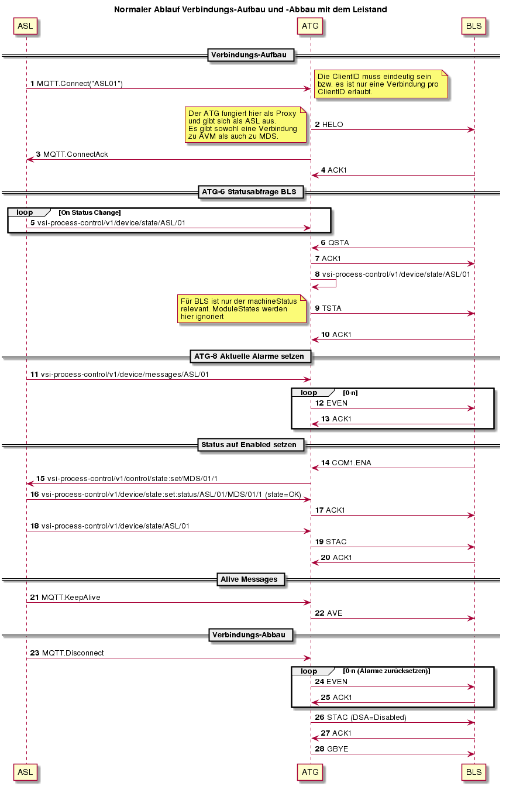</span>

</div>

Beispiel-Requests

<div class="content-wrapper">

#### <span class="nh-number">6.2.3.1. </span>Beispiel für Step 5: state (Push States)

<div class="preformatted panel" style="border-width: 1px;">

<div class="preformattedContent panelContent">

    {
        "timestamp": "2018-03-05T15:11:28.000Z",
        "machineState": 1,
        "moduleStates": [
            {
                "name": "CLC21",
                "value": 10
            },
            {
                "name": "TRC01",
                "value": 10
            }
        ]
    }

</div>

</div>

#### <span class="nh-number">6.2.3.2. </span>Beispiel für Step 11: messages (Push Alarme)

<div class="preformatted panel" style="border-width: 1px;">

<div class="preformattedContent panelContent">

    {
        "timestamp": "2018-03-05T15:11:28.000Z",
        "messages": [
            {
                "id": 50765,
                "initiator": "CLC21",
                "priority": "ALARM",
                "state": "APPEAR",
                "acknowledge": false,
                "text": "Safety Stop at device %0 in module %1.",
                "parameters": [
                    "Shute3401",
                    "TraySorter1"
                ]
            }
        ]
    }

</div>

</div>

#### <span class="nh-number">6.2.3.3. </span>Beispiel für Step 15: state:set (Set Enabled)

<div class="preformatted panel" style="border-width: 1px;">

<div class="preformattedContent panelContent">

    {
        "timestamp": "2018-03-05T15:11:28.000Z",
        "machineState": 2,
        "moduleStates": [
            {
                "name": "CLC21",
                "value": 20
            },
            {
                "name": "TRC01",
                "value": 20
            }
        ]
    }

</div>

</div>

#### <span class="nh-number">6.2.3.4. </span>Beispiel für Step 16: state:set:status (Push changes Set Enabled)

<div class="preformatted panel" style="border-width: 1px;">

<div class="preformattedContent panelContent">

    {
        "timestamp": "2018-03-05T15:11:28.000Z",
        "machineState": 2,
        "moduleStates": [
            {
                "name": "CLC21",
                "value": 20
            },
            {
                "name": "TRC01",
                "value": 20
            }
        ]
    }

</div>

</div>

</div>

Fragen

<div class="content-wrapper">

<span style="color: rgb(255,0,0);"><span style="color: rgb(0,0,0);"><span style="color: rgb(255,0,0);">**TODO ** </span>Wollen
wir pro API eine separate Verbindung über MQTT oder eine?  
</span></span>

<span style="color: rgb(255,0,0);">**TODO ** </span>[Pham Huy Hoang,
I121 extern](https://wikit.post.ch/display/~phamh): MachineState-Mapping
definieren vsi → PP2k

<span style="color: rgb(255,0,0);">**TODO ** </span>[Pham Huy Hoang,
I121 extern](https://wikit.post.ch/display/~phamh): Welche Alarme soll
ATG von ASL an BLS weitergeben? Diese müssen in BLS vorkonfiguriert
werden... Hoang: Wird ein 1:1-Mapping machen, welche weitergeleitet
werden
müssen

<span style="color: rgb(0,0,0);"><span style="color: rgb(255,0,0);">**TODO ** </span>Genügt
das MQTT.KeepAlive, um die Verbindung zu verifizieren oder sollten wir
ein explizites MQTT.Ping haben? KeepAlive wird offenbar nur geschickt,
wenn in einem definierten Interval keine anderen Meldungen über die
Verbindung geschickt wurden, wogegen PP2000 ein Ping in jedem Fall
erwartet, unabhängig von anderen
Meldungen</span>

<span style="color: rgb(255,0,0);">**TODO ** </span><span style="color: rgb(0,0,0);">Genügt
das MQTT.Disconnect für den Verbindungsabbau oder sollten wir ein
explizites MQTT.GBYE-Event haben?</span>

<span style="color: rgb(255,0,0);">**TODO** [Pham Huy Hoang, I121
extern](https://wikit.post.ch/display/~phamh)
<span style="color: rgb(0,0,0);">Sample-JSON mit mehreren Alarmen
liefern</span></span>

<span style="color: rgb(255,0,0);"><span style="color: rgb(0,0,0);"><span style="color: rgb(255,0,0);">**TODO ** </span>[Pham
Huy Hoang, I121 extern](https://wikit.post.ch/display/~phamh): Wie soll
sich ASL im Status Disabled
verhalten?</span></span>

</div>

  

<div class="table-wrap">

### <span class="nh-number">6.2.4. </span>ATG-7 Parameter-Status empfangen

</div>

Kurzbeschreibung

 

Akteur

 

Auslösendes
Ereignis

 

Vorbedingung

 

Diagramm

(Empfohlen)

<div class="content-wrapper">

  
<span class="confluence-embedded-file-wrapper" style="">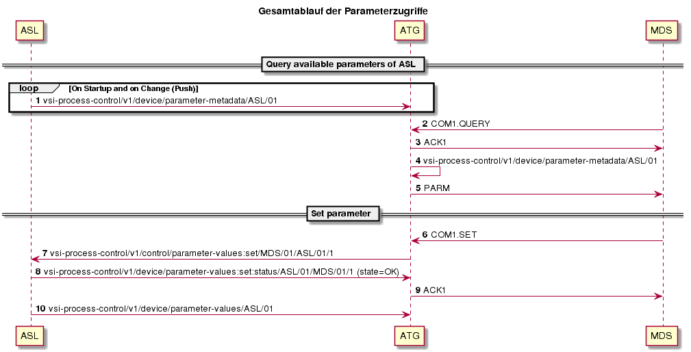</span>

</div>

Beispiel-Requests

<div class="content-wrapper">

#### <span class="nh-number">6.2.4.1. </span>Beispiel für Step 1: parameter-metadata (Return available parameters)

<div class="preformatted panel" style="border-width: 1px;">

<div class="preformattedContent panelContent">

    {
        "timestamp": "2018-03-05T15:11:28.000Z",
        "parameters": [
            {
                "name": "OutletGroupNumber",
                "modifiable": false,
                "factoryValue": "2",
                "type": "INTEGER",
                "min": "1",
                "max": "2",
                "description": "Number of outlet groups for parcel sorting"
            },
            {
                "name": "MaxParcelWeightSorter",
                "modifiable": true,
                "factoryValue": "40000",
                "type": "INTEGER",
                "min": "100",
                "max": "50000",
                "description": "Maximum parcel weight (in Gramm) allowed"
            },
            {
                "name": "SorterHighLoad",
                "modifiable": true,
                "factoryValue": "75",
                "type": "INTEGER",
                "min": "10",
                "max": "95",
                "description": "Maximum filllevel of Sorter"
            },
            {
                "name": "RejectDestination",
                "modifiable": true,
                "factoryValue": "=ASL.RU014",
                "type": "STRING",
                "min": "0",
                "max": "100",
                "description": "Reject destination of the sorter"
            }
        ]
    }

</div>

</div>

#### <span class="nh-number">6.2.4.2. </span>Beispiel für Step 7: parameter-values:set (Set Parameter)

<div class="preformatted panel" style="border-width: 1px;">

<div class="preformattedContent panelContent">

    {
        "timestamp": "2018-03-05T15:11:28.000Z",
        "parameterValues": [
            {
                "name": "MaxParcelWeightSorter",
                "newValue": "35000",
                "type": "INTEGER"
            },
            {
                "name": "SorterHighLoad",
                "newValue": "60"
            }
        ]
    }

</div>

</div>

#### <span class="nh-number">6.2.4.3. </span>Beispiel für Step 10: parameter-values (Parameter Updated)

<div class="preformatted panel" style="border-width: 1px;">

<div class="preformattedContent panelContent">

    {
        "timestamp": "2018-03-05T15:11:28.000Z",
        "parameterValues": [
            {
                "name": "MaxRecirculationSorter",
                "newValue": "3",
                "oldValue": "2"
            },
            {
                "name": "MaxParcelWeightSorter",
                "newValue": "35000",
                "oldValue": "30000"
            }
        ]
    }

</div>

</div>

</div>

Normaler Ablauf

<span>ASL antwortet auf einen get-request mit
group\_name=parameter\_list eine generische Liste der Parameter zurück,
das es unterstützt. Es ist allerdings zu beachten, dass Parameter in BLS
eine eindeutige, 5-stellige ID haben müssen. Falls man Parameter in BLS
ändern können soll, bräuchte man hier also ein Konzept, wie
ASL-Parameter-Namen auf BLS-Namen gemappt werden sollen.</span>

Alternativer Ablauf

 

Ausnahme Ablauf

 

Nachbedingung  
(Ergebnis)

 

Fragen

<div class="content-wrapper">

<span style="color: rgb(255,0,0);">**TODO ** </span>[Pham Huy Hoang,
I121 extern](https://wikit.post.ch/display/~phamh)<span>: Wie sollen
ASL-Parameter in BLS gehandhabt werden (siehe Beschreibung oben)?
Vielleicht Beispiel-Wert liefern, z.B. Schongang oder Anzahl Runden vor
Ausschuss.</span>

</div>

<div class="table-wrap">

### <span class="nh-number">6.2.5. </span>ATG-9 Live-Daten empfangen

</div>

Kurzbeschreibung

 

Akteur

 

Auslösendes
Ereignis

 

Vorbedingung

 

Diagramm

(Empfohlen)

<div class="content-wrapper">

 <span class="confluence-embedded-file-wrapper" style="">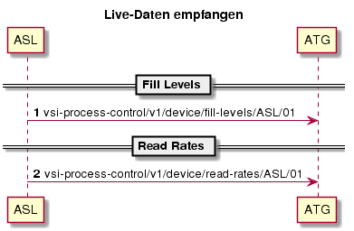</span>

</div>

Beispiel-Requests

<div class="content-wrapper">

#### <span class="nh-number">6.2.5.1. </span>Beispiel für Step 1: fill-levels

<div class="preformatted panel" style="border-width: 1px;">

<div class="preformattedContent panelContent">

    {
        "timestamp": "2018-03-05T15:11:28.000Z",
        "fillLevels": [
            {
                "processPoint": "=ASL.SORT1",
                "total": 30,
                "capacity": 250,
                "noDestination": 2,
                "destinationMCS": 9,
                "destinationReject": 1
            }
        ]
    }

</div>

</div>

#### <span class="nh-number">6.2.5.2. </span>Beispiel für Step 2: read-rates

<div class="preformatted panel" style="border-width: 1px;">

<div class="preformattedContent panelContent">

    {
        "timestamp": "2018-03-05T15:11:28.000Z",
        "readRates": [
            {
                "processPoint": "=ASL.IND300",
                "total": 300,
                "read": 290
            }
        ]
    }

</div>

</div>

</div>

Normaler
Ablauf

 

<span style="color: rgb(255,0,0);"><span style="color: rgb(0,0,0);">Live-Daten
werden von der Anlage periodisch an den AT-Gateway geschickt (kein
get-request) und können 1-n Datensätze beinhalten.</span></span>

<span style="color: rgb(255,0,0);"><span style="color: rgb(0,0,0);">Der
AT-Gateway kann eine Live-Data-Meldung in mehrere Leitstand-Meldungen
aufteilen (basierend auf deren Inhalt), aber nicht mehrere Meldungen zu
einer Leitstand-Meldung zusammenführen.</span></span>

Alternativer Ablauf

 

Ausnahme Ablauf

 

Nachbedingung  
(Ergebnis)

 

<span>Fragen</span>

<div class="content-wrapper">

<span style="color: rgb(255,0,0);">**TODO ** </span>[Pham Huy Hoang,
I121 extern](https://wikit.post.ch/display/~phamh)<span>: Definieren,
welche Daten in welchem Format an welche Ablage geschickt
werden</span>

</div>

<div class="table-wrap">

### <span class="nh-number">6.2.6. </span>ATG-10 Statistik-Daten empfangen

</div>

Kurzbeschreibung

 

Akteur

 

Auslösendes
Ereignis

 

Vorbedingung

 

Diagramm

(Empfohlen)

<div class="content-wrapper">

 <span class="confluence-embedded-file-wrapper" style="">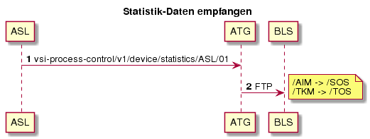</span>

</div>

Beispiel-Requests

<div class="content-wrapper">

#### <span class="nh-number">6.2.6.1. </span>Beispiel für Step 1: statistics (Stats)

<div class="preformatted panel" style="border-width: 1px;">

<div class="preformattedContent panelContent">

    {
        "timestamp": "2018-03-05T15:11:28.000Z",
        "stats": [
            {
                "processPoint": "TKM01",
                "frequency": 5,
                "type": "TRAY_STAT",
                "values": ["720","180","0","0","0","0"]
            }
        ]
    }

</div>

</div>

</div>

Normaler Ablauf

 <span style="color: rgb(0,0,0);">Statistik-Daten werden von der Anlage
periodisch an den AT-Gateway geschickt (kein get-request) und können 1-n
Datensätze beinhalten.</span>

Alternativer Ablauf

 

Ausnahme Ablauf

 

Nachbedingung  
(Ergebnis)

 

Fragen

<div class="content-wrapper">

<span style="color: rgb(255,0,0);">**TODO ** </span>[Pham Huy Hoang,
I121 extern](https://wikit.post.ch/display/~phamh)<span>: Definieren,
welche Daten in welchem Format an welche Ablage geschickt
werden.</span><span> AIM → /SOS, TKM →
/TOS?</span>

</div>

  

<div class="table-wrap">

### <span class="nh-number">6.2.7. </span>ATG-11 Track-Event-Daten empfangen

</div>

Kurzbeschreibung

 

Akteur

 

Auslösendes
Ereignis

 

Vorbedingung

 

Diagramm

(Empfohlen)

<div class="content-wrapper">

 <span class="confluence-embedded-file-wrapper" style="">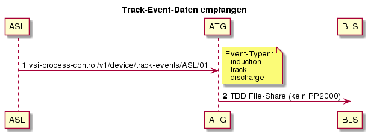</span>

</div>

Beispiel-Requests

<div class="content-wrapper">

#### <span class="nh-number">6.2.7.1. </span>Beispiel für Step 1: track-events (discharge, induction)

<div class="preformatted panel" style="border-width: 1px;">

<div class="preformattedContent panelContent">

    {
        "timestamp": "2018-03-05T15:11:28.000Z",    
        "trackEvents": [
            {
                "eventType": "DISCHARGE",
                "processPoint": "=ASL.RU12",
                "itemId": "091375859932",
                "mailpieceId": "984047236111062608",
                "dischargeReason": "OK"
            },
            {
                "eventType": "INDUCTION",
                "processPoint": "=ASL.IND300",
                "itemId": "0984382394398",
                "mailpieceId": "984047236111062608"
            }
        ]
    }

</div>

</div>

</div>

Normaler Ablauf

 

Alternativer Ablauf

 

Ausnahme Ablauf

 

Nachbedingung  
(Ergebnis)

 

Fragen

  

<div id="footer" data-role="contentinfo">

<div class="section footer-body">

Document generated by Confluence on Nov 28, 2018 16:13

<div id="footer-logo">

[Atlassian](http://www.atlassian.com/)

</div>

</div>

</div>
